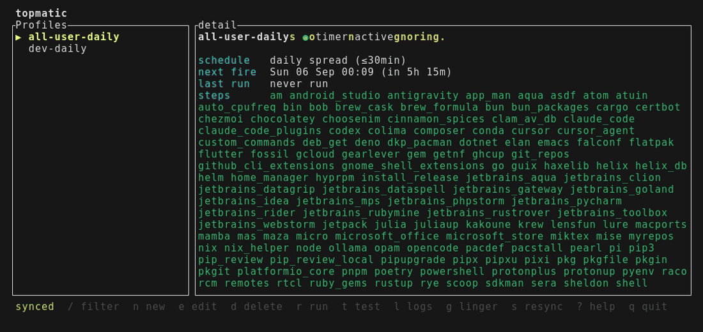
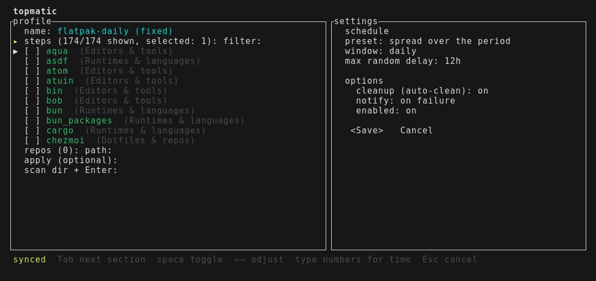
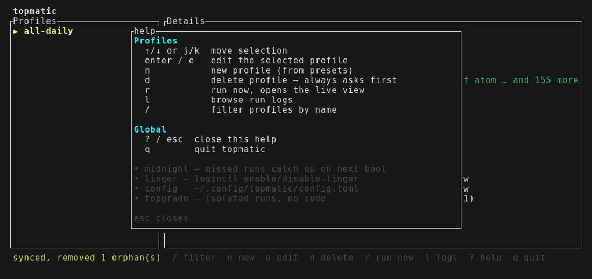
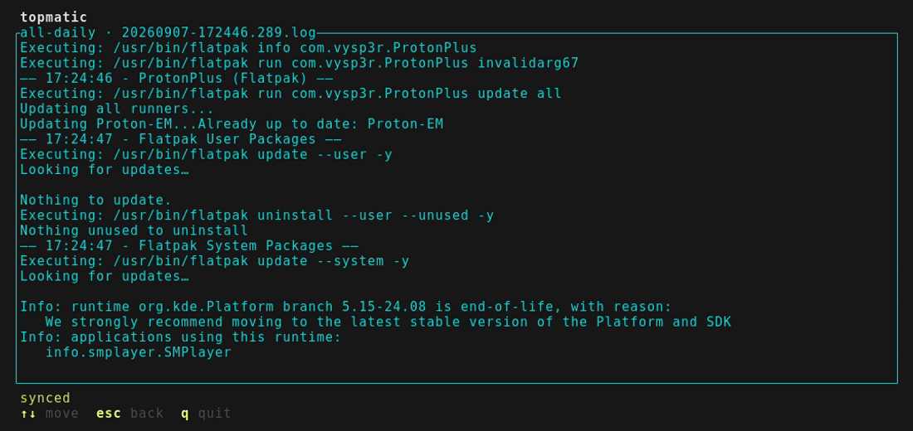

# topmatic

Your user-level tools, updated automatically — without sudo.



Flatpaks, cargo installs, npm globals, pipx apps… [topgrade](https://github.com/topgrade-rs/topgrade) already knows how to update all of them. topmatic turns topgrade into scheduled jobs you manage from a TUI: pick what to update, when, and forget it.

## Why

- You want automatic updates of **your** software, without root, daemons or cron hacks
- Your own topgrade config stays untouched — topmatic always runs topgrade with an isolated config
- Machines are off sometimes: timers are `Persistent=` and catch up missed runs
- Jobs run at minimum priority (`Nice=19`, batch CPU, idle IO) — never in your way
- Schedules are frequencies anchored at midnight with a small random delay (≤5min), so nothing hammers mirrors at the same second
- Flaky runs self-heal: steps retry immediately, failed runs retry with growing delays behind a connectivity check, and you only hear about a failure that survived all of that
- Self-healing: every start rewrites drifted unit files, prunes stray schedule overrides and removes orphan timers of profiles that no longer exist; `topmatic doctor` diagnoses and `topmatic reset` starts clean
- Owns only what it proves: a timer is only ever touched if it carries topmatic's schedule drop-in (`topmatic@<profile>.timer.d/10-schedule.conf`), so timers created by other tools — even ones named `topmatic@*` — are left alone with a note instead of being deleted

## Requirements

- Linux with systemd (user session)
- [topgrade](https://github.com/topgrade-rs/topgrade) in `PATH` (`cargo install topgrade`, or your distro package manager)
- Rust toolchain (to install from source)

## Install

```sh
cargo install --git https://github.com/c4i0b/topmatic
```

Then run `topmatic` once: it installs the systemd user units and converges the timers to your config. To let timers fire while you are logged out, enable lingering yourself (`loginctl enable-linger`) — topmatic shows its state and explains it, but never runs anything privileged.

## Use

```sh
topmatic          # TUI
topmatic list     # profiles, next run, last status
topmatic doctor   # diagnose + auto-repair unit drift (shows the effective run policy)
topmatic doctor --repair  # quarantine a broken config and start fresh
topmatic sync     # converge systemd units to the config
topmatic edit     # back up the config, edit it with $EDITOR, then sync
topmatic run <profile> [--dry-run]
topmatic reset [--all]   # remove units/schedules/history; --all also archives the config
```

In the TUI: `n` new (from a preset), `e` edit, `d` delete, `r` run now (opens the live log view right away — output streams in while it runs, `x` stops the run, `esc` goes back while the dashboard badge keeps tracking `running · 42s`), `l` logs, `/` filter, mouse click/scroll, `?` help overlay, `q` quit (lower or upper case; while a filter is active, `q` is just a letter). The right pane shows live details for the selected profile: schedule, countdown to next fire, timer state and the tail of the last run log.

The editor cycles its sections with `Tab` — steps, schedule, options, save — and `Enter` acts on the highlighted row: it toggles a step, opens a picker for the schedule frequency or for notifications, or opens the save flow from the save row — name, then a summary with Confirm/Cancel (a `*` marks unsaved changes). Schedules are frequencies anchored at midnight — daily, every 6 or 12 hours, weekly, every 2 weeks or monthly; missed runs catch up on the next boot.

New profiles start from a preset — everything user-level, dev tools or Flatpak — with steps pre-selected, a suggested name and the default schedule; tweak anything before saving. Presets are computed live from your installed topgrade, so they always match its step list.



Press `?` anywhere for the full key map and what lingering means:



Every run leaves a log you can browse with `l`:



Profiles live in `~/.config/topmatic/config.toml` — edit it by hand or via TUI, both are first-class; topmatic reconciles systemd to match it on every start. A `[defaults]` table tunes the run behavior for every profile (`retries`, `retry_delay`, `give_up_after`, `network_wait`, `random_delay` as `2min`-style values); `config.example.toml`, regenerated next to it, documents every key with the current defaults.

### Schedules as dotfiles

`~/.config/topmatic/config.toml` is the single source of truth and safe to share between machines (e.g. into your dotfiles repo). On a new machine, just restore that file and run `topmatic` once: it installs the unit templates and re-creates every timer with the schedule from the config. Do **not** share `~/.local/state/topmatic` (run history and logs are machine-local) or `~/.config/systemd/user` — those units regenerate automatically, and stale symlinks are repaired by the sync.

Two safety guarantees around the sync:

- A timer without a matching profile but **with** topmatic's schedule drop-in is an orphan of a removed profile and gets cleaned up.
- A `topmatic@*` timer **without** topmatic's drop-in was created by something else — topmatic leaves it alone and just reports it, so other tools can coexist without their jobs being deleted.

## Development

```sh
just check # fmt + clippy + tests
```

`just --list` shows every recipe. Tests use stubs instead of real topgrade/systemd, so they run anywhere a Rust toolchain exists; the only exception is `tests/systemd_integration.rs`, which needs a real user systemd and skips otherwise.

## License

MIT
